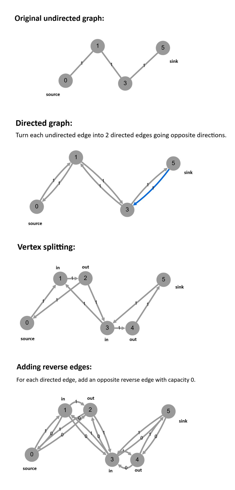
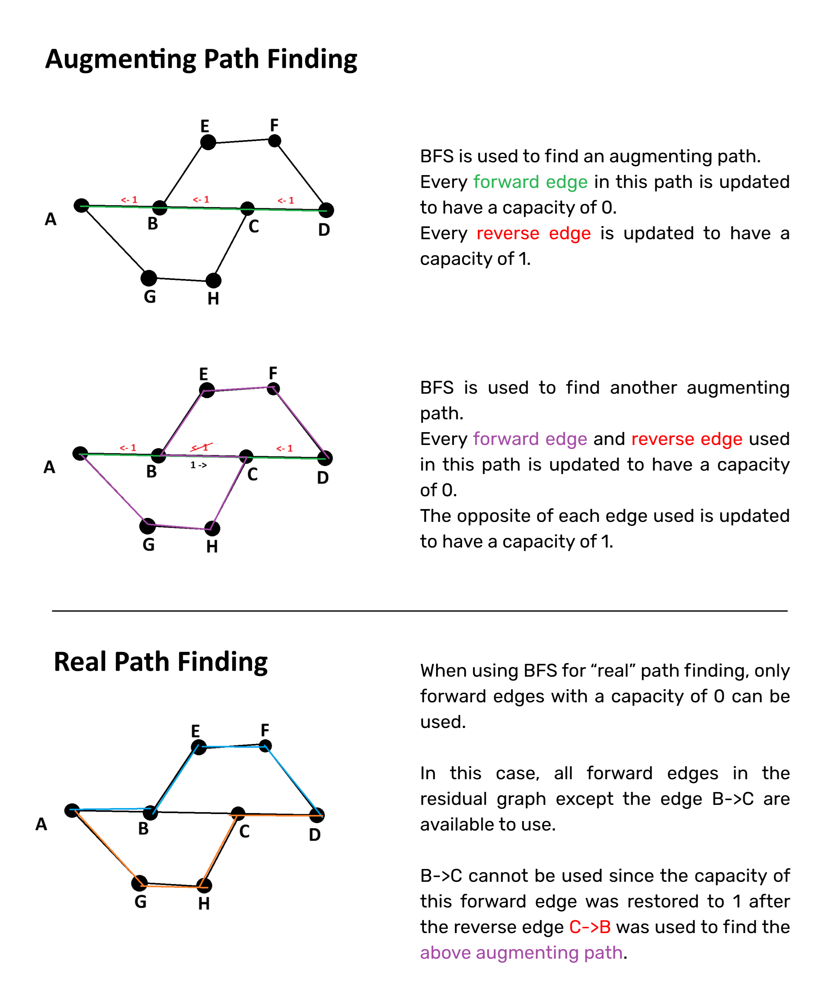

# Pathfinder

A CLI path-finding algorithm that finds the most efficient paths to move trains from one destination to another with minimal turns.

## The Train Network
The train network uses fixed-block signaling for train movements. In a single movement turn, trains can move to a neighboring station. Connected stations have a single bidirectional track between them with a maximum capacity of one train. Each intermediate station can be used by only one train at a time. The start and end stations can hold an unlimited number of trains.

In graph theory terms, the original train network could be described as a an **undirected graph**. Given the above constraints, we aimed to find the most optimal set of non-overlapping paths that are both **edge-disjoint** and **vertex-disjoint** (neither using the same tracks nor stations) to reduce the total number of movement turns.


## Pathfinder Algorithm 
1. Parse and validate CLI arguments
2. Parse and validate network map file, extracting stations and connections data
3. Create a residual graph
4. Find multiple sets of non-overlapping paths using a modified **Edmonds-Karp / Dinic** algorithm
5.  Find the path set from the set of path sets with the lowest average number of turns
6.  Divide trains, assigning each train to a path from the path set
7.  Simulate train movements to create a turn schedule
8.  Print schedule

We implemented modified versions of two different algorithms for the pathfinding step:
- Edmonds-Karp for the default path routing.
- Dinic, accessible through the `-alg Dinic` flag.

**A detailed explanation of the Edmonds-Karp algorithm and its modified implementation can be found [below](#edmonds-karp-algorithm).**


## Setup and Usage

Clone the repository using HTTPS:

```bash
git clone https://gitea.kood.tech/aliadaahirmohamed/pathfinder.git
```

Or using SSH:

```bash
git clone git@gitea.kood.tech:aliadaahirmohamed/pathfinder.git
```

Navigate to the project:

```bash
cd pathfinder
```

Run using the **Edmonds-Karp** algorithm:

```bash
go run . [MAPFILE] [STARTSTATION] [ENDSTATION] [TRAINNUMBER]
```

Or run using the **Dinic** algorithm:

```bash
go run . -alg Dinic [MAPFILE] [STARTSTATION] [ENDSTATION] [TRAINNUMBER]
```

Run unit tests:

```bash
cd unitTest
go test
```

## Example Usage
### Input
```bash
go run . -alg Dinic network/london_network.map waterloo st_pancras 6
```

### Output result
```bash
TURN SCHEDULE (4 turns):
T1-victoria T2-euston 
T1-st_pancras T3-victoria T2-st_pancras T4-euston 
T3-st_pancras T5-victoria T4-st_pancras T6-euston 
T5-st_pancras T6-st_pancras 

Trains scheduled successfully!
4 turns to move 6 trains from waterloo to st_pancras using the path set of 2 non-overlapping paths:
[[waterloo victoria st_pancras] [waterloo euston st_pancras]]

Algorithm used: Dinic
Execution Time: 194.497µs
```

The number of lines printed in the turn schedule is the number of movement turns.

## The Network Map File
The network map file is just a plain text file with a `.map` extension. 

The network map must contain a **"stations:"** header and **"connections:"** header. Comments preceded by a `#` symbol are ignored during parsing.

Each station line must follow the following format: `<station name>,<x-coordinate>,<y-coordinate>`

Connections describe a track connecting two stations: `<station 1>-<station 2>`

### Example network map
```
# London Network Map

stations:
waterloo,3,1
victoria,6,7
euston,11,23
st_pancras,5,15

connections:
waterloo-victoria
waterloo-euston
st_pancras-euston
victoria-st_pancras
```

## Edmonds-Karp Algorithm
The [Edmonds-Karp](https://en.wikipedia.org/wiki/Edmonds%E2%80%93Karp_algorithm) algorithm is an implementation of the [Ford–Fulkerson](https://en.wikipedia.org/wiki/Ford%E2%80%93Fulkerson_algorithm) method that computes the maximum flow in a [flow network](https://en.wikipedia.org/wiki/Flow_network). A flow network is a directed graph where each edge has a capacity measured in units of flow. A unit of flow sent from source to sink reduces the capacity of each edge it uses by 1.

### How it works
1. A residual flow graph is created where each forward (real) edge has a corresponding reverse (fake) edge with a capacity of 0.
2. BFS (breadth-first search) is used to find the shortest augmenting path in this graph. An [augmenting path](https://en.wikipedia.org/wiki/Flow_network#Augmenting_paths) is any path from the source to the sink where additional flow can be sent through in the residual graph. The difference between an augmenting path and what we call a "real" path is that an augmenting path may contain reverse (fake) edges used to undo and reroute previously sent flow. These reverse edges do not exist in the original graph, and finding real paths from the residual graph is a separate process, which will be explored more in depth [later on](#finding-the-real-paths).
3. Updating the maximum flow: The bottleneck or the minimal residual capacity of the edges in the augmented path is found and added to the maximum flow counter.
4. Updating the residual graph: For every edge used in this augmenting path, the forward edge capacity is reduced by the flow amount, which will be the bottleneck of the augmenting path. On the flip side, the reverse edge capacity is increased by the same amount. 
5. Steps 2 and 3 are executed repeatedly on the updated residual graph until no more augmenting paths can be found.

### Applying Edmonds-Karp to our train-routing problem
In our case, a unit of "flow" can be thought of as a single train. Modelling our train network as a flow network where the maximum capacity of both edges (tracks) and nodes (stations) are always 1, **the maximum flow would be equivalent to the maximum number of non-overlapping paths** from the start to end stations. The maximum flow tells us the number of trains that can arrive at the end station in a single movement turn.

The Edmonds-Karp algorithm uses breadth-first search (BFS) to find augmenting paths — paths that can be used to increase the total flow in a flow network. 

### Graph transformations
In order to use Edmonds-Karp, we first need create a **residual flow graph** from our undirected train network as the Edmonds-Karp algorithm operates on a **directed flow network**.

This required the following transformations:
- **Vertex-splitting** of all station nodes except the start and end stations
	- Vertex-splitting is a trick to set a capacity for a node by representing the vertex as an edge with a capacity. 
	- **Example:** Vertex V is split into `V_in` and `V_out` with a single directed edge `V_in -> V_out` with a capacity of 1
- **Turning undirected edges into directed edges with capacity**
	- A bidirectional train track from stations `A<->B` would then be represented as two forward edges: `A->B` and `B->A`, each with a capacity of 1*
	- More specifically, if `A` and `B` are not start/end stations, the edges are created using the vertex split halves: `A_out -> B_in` and `B_out -> A_in`
	- *Although it may seem problematic to create a separate capacity of 1 for each direction when the total capacity of a track is 1, setting a node capacity of 1 via the vertex-splitting method enforces that each track can have 1 flow (train) total.
- **Creating a reverse (fake) edges**
	- The residual graph requires that each forward edge has corresponding a reverse (fake) edge of capacity of 0. Every time a flow is sent through a forward edge during the search for augmenting paths, the residual capacity of the forward edge decreases by 1 down to 0 while the corresponding reverse edge increases by 1. Intuitively, the reverse (fake) edge represents the capacity to "undo" a flow during the search for augmenting paths and try another path leading from the parent of the "undone" edge. 

### Visualizing the graph transformations


*Diagram made using [Algorithm Calculator](https://algorithmcalculator.com/directed-graph/edmonds-karp).*

### Finding the real paths
After creating a residual graph and running Edmonds-Karp to find the maximum flow, how do we get the set of real paths that can be used to achieve this flow?

For this, a slightly modified BFS is used on the residual graph. The main difference between the BFS used for finding augmenting paths vs the BFS used for finding real paths is in the condition that checks whether an edge should be used. 

**For finding augmenting paths, there is only one condition:**

The edge must have remaining capacity (i.e. residual capacity > 0).

**For finding real paths, the following set of conditions must be met:**
- The edge must have a remaining capacity of 0. Since the original capacities of our forward edges were 1, a capacity of 0 indicates that the edge was used in an augmenting path and therefore can be used to get to the sink
- The edge must be a forward (real) edge
- The edge must have not already been used during real path finding

This version of the BFS is run repeatedly until no more real paths can be found. Between iterations, the edges used in the real paths found are logged to avoid reuse, but the capacities are not modified in the residual graph. The number of real paths found should be equivalent to the maximum flow found.

In addition, the real path finding BFS can be run any time after finding an augmenting path to extract the current set of non-overlapping real paths that would lead to some amount of flow. For example, with a maximum flow of 3, you could find up to 3 sets of non-overlapping paths to choose from if you search for real paths after every augmentation rather than at the very end. Since **Edmonds-Karp only optimizes for maximum flow and ignores cost**, searching for real paths only after maximum flow has been reached may lead to a single large set of paths with high cost (long paths using many stations) when a smaller set of paths with lower cost may be better depending on the number of trains that need to be moved.

### Pathfinding Visualization


## Bonus Features

1. Implemented advanced error handling.
2. Implemented super advanced error handling.
3. Names problematic entities or specifies the line on which the error occurs.
4. Unit testing implemented for each major function.

## Authors

- Ellin
- Alia